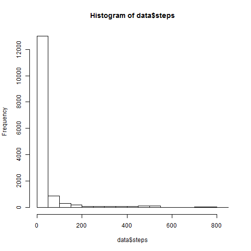
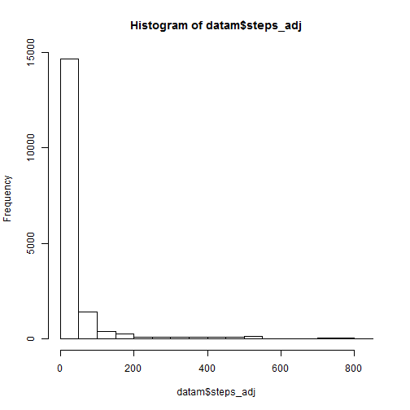
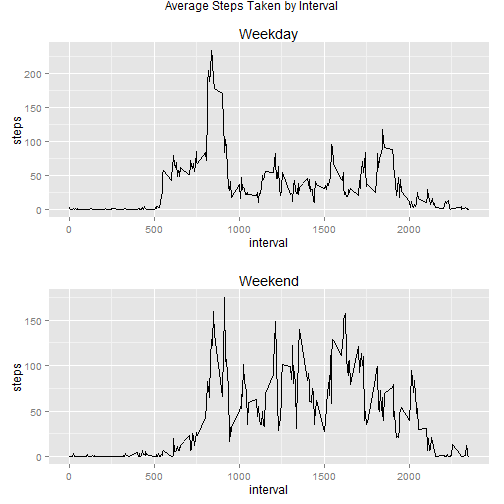

# Peer Assessment 1
### Daniel Elbaz
========================================================

## Loading and processing the data set


```r
data <- read.csv("activity.csv")
data$date <- as.Date(data$date)
```


## Mean and Median of the total number of steps taken each each
### Histogram of Steps Taken

```r
hist(data$steps)
```

 


### Mean and Median of Steps

```r
mean(data$steps, na.rm = TRUE)
```

```
## [1] 37.38
```

```r
median(data$steps, na.rm = TRUE)
```

```
## [1] 0
```


## Average Daily Activity Pattern

```r
agg <- aggregate(steps ~ interval, data, mean, na.rm = TRUE)
```

### Plot of Average Daily Activity Pattern by Interval

```r
plot(agg[, c("interval", "steps")], type = "l")
```

 


### The Interval with the highest average:

```r
agg[which.max(agg$steps), "interval"]
```

```
## [1] 835
```


## Accounting for NA Values

### Number of NA Values:

```r
length(data[is.na(data$steps), "steps"])
```

```
## [1] 2304
```


### If the value is NA, use the mean for that interval

```r
datam <- merge(data, agg, by = "interval")
datam$steps_adj <- ifelse(is.na(datam$steps.x), datam$steps.y, datam$steps.x)
```


## Replot Histogram and Calculate the Mean/median. The mean and median remain the same with this methodology...

```r
hist(datam$steps_adj)
```

 

```r
mean(datam$steps_adj)
```

```
## [1] 37.38
```

```r
median(datam$steps_adj)
```

```
## [1] 0
```


## Difference in Activity Pattern for Weekdays vs. Weekends.
### Breakout and Plot Average Steps by Weekday/Weekend

```r
suppressWarnings(library(ggplot2))
suppressWarnings(library(gridExtra))
data$weekday <- factor(ifelse(weekdays(data$date) %in% c("Saturday", "Sunday"), 
    "weekend", "weekday"))
agg2 <- aggregate(steps ~ interval + weekday, data, mean, na.rm = TRUE)
p1 <- ggplot(agg2[agg2$weekday == "weekday", c(1, 3)], aes(x = interval, y = steps)) + 
    geom_line() + ggtitle("Weekday")
p2 <- ggplot(agg2[agg2$weekday == "weekend", c(1, 3)], aes(x = interval, y = steps)) + 
    geom_line() + ggtitle("Weekend")
grid.arrange(p1, p2, ncol = 1, main = "Average Steps Taken by Interval")
```

 

